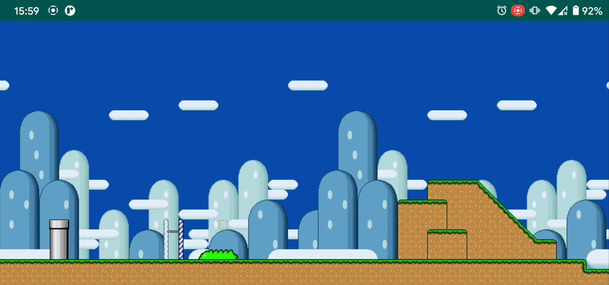
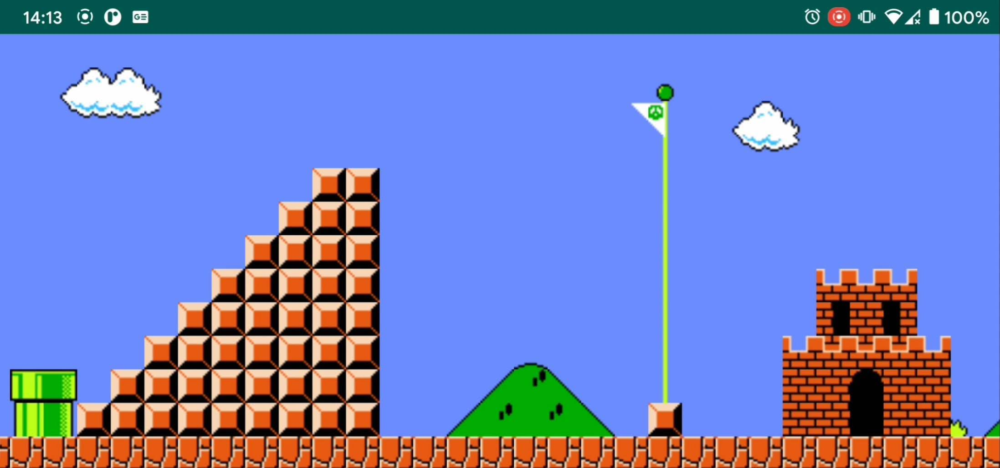

# Tiled: Tilemaps on Android

Tiled is a lightweight API for easily creating tilemaps in Android. It is useful for applications and games which need
to display tile-based graphics.



## The Tilemap Data Structure

Tilemaps are a very popular technique in 2D game development, consisting of building the game world or level map out of
small, regular-shaped images called tiles. Think about any game that uses regularly repeating squares of background, and
you'll probably find it uses tilemaps.

# How to Use

## Installation

[](https://bintray.com/saifkhichi96/maven/tiled/_latestVersion)

Open the module level `build.gradle` file and add dependency to this library using:

```
dependencies {
  // ...
  implementation "dev.aspirasoft.apis:tiled:${latestVersion}"
}
```

Replace `${latestVersion}` with the latest release version number.

## The [`TiledView`](./tiles/src/main/java/dev/aspirasoft/apis/tiled/TiledView.kt) class

`TiledView` is a custom [View](https://developer.android.com/reference/android/view/View) which you can use in your
layouts just how you would use any other view.

```
<dev.aspirasoft.apis.tiled.TiledView
    xmlns:custom="http://schemas.android.com/apk/res-auto"
    android:layout_width="match_parent"
    android:layout_height="match_parent"
    custom:orientation="horizontal"
    custom:allowManualScroll="true"/>
```

If you want the view to be scrollable by touch, set the `allowManualScroll` attribute to `true`. This is disabled by
default, and you can only scroll the view programmatically.

You can also set the scroll direction with the `orientation` attribute, which takes three values: `horizontal` (default)
, `vertical`  and `none`. In case of `none`, a fixed tilemap is displayed, with the whole map scaled to fit the size of
the view / device screen.

## Demo

[](https://youtu.be/KlIh_w0GX58)

In the [demo app](./demo/src/main/java/dev/aspirasoft/apis/tiled/demo/MarioDemo.kt), we use this library to build a
powerful Super Mario Bros. user-interface. You can [watch the complete demo here](https://youtu.be/KlIh_w0GX58).
